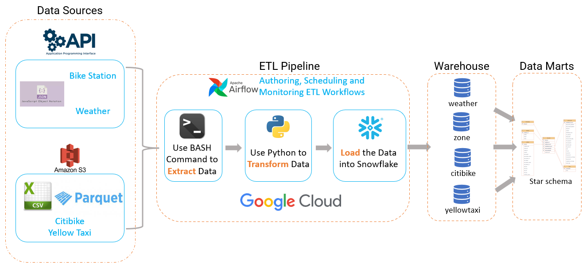
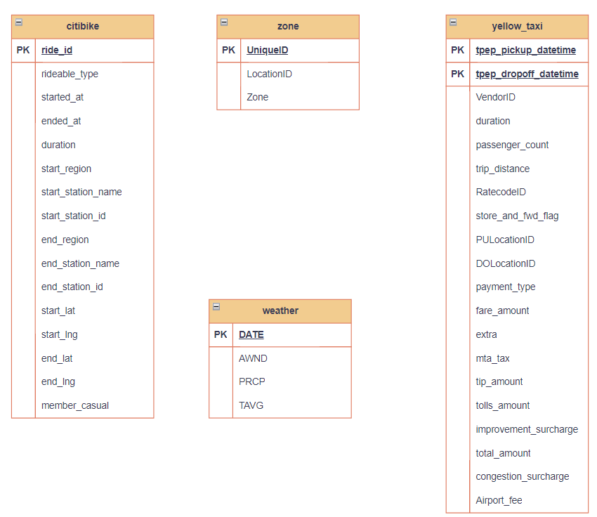
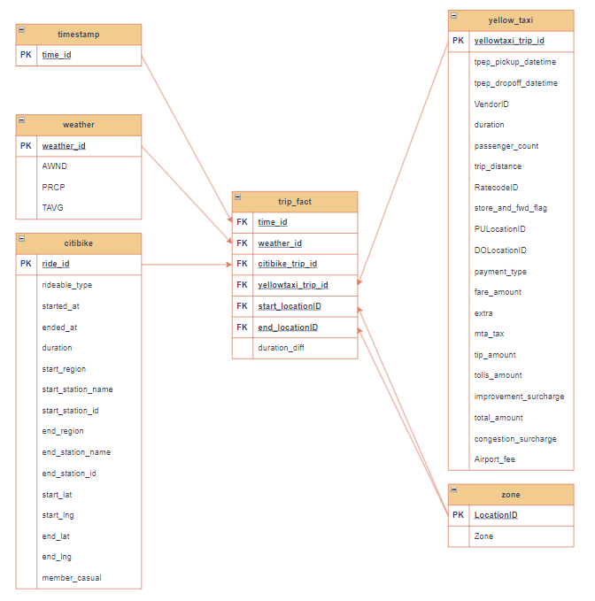
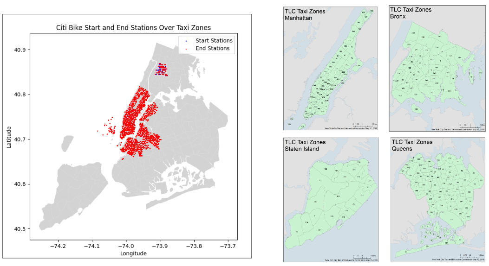
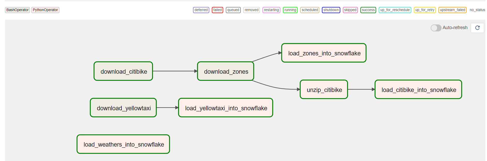
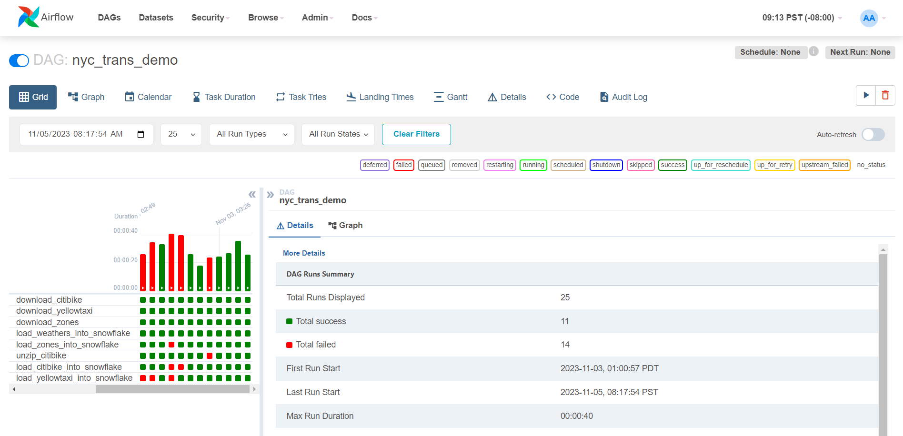
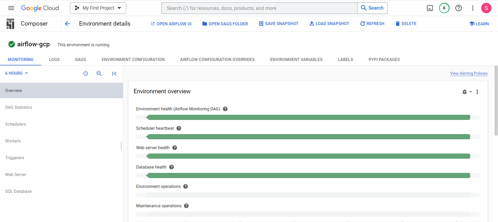

# NYC Transportation ETL Pipeline

Building an ETL (Extract, Transform, Load) pipeline using Python and leveraging Apache Airflow for orchestration, testing on Docker, finally deploying the pipeline on the Google Cloud Platform (GCP).

## Acknowledgements

 - [Code accompanying Chapter 14 of the book Data Pipelines with Apache Airflow](https://github.com/BasPH/data-pipelines-with-apache-airflow/tree/master/chapter14)
 - [Data Pipelines with Apache Airflow](https://github.com/matiassingers/awesome-readme)
 - [TLC Trip Record Data](https://www.nyc.gov/site/tlc/about/tlc-trip-record-data.page)
 - [Citi Bike Trip Histories](https://citibikenyc.com/system-data)
 - [NOAA - NYC Weather History](https://www.ncdc.noaa.gov/cdo-web/search)
 - [CityBikes API](https://api.citybik.es/v2/)

## Roadmap

- Extract Data from diverse sources, such as weather datasets, Citibike records, yellow taxi information, and geographic zone details.

- Transform Data within Python, employing various data processing techniques. This involves tasks like computing trip durations and enhancing data quality by mapping geographical coordinates to relevant region IDs.

- Load Data into Snowflake by establishing a connection to your Snowflake data warehouse via Python, enabling the efficient transfer of the processed data. The connection setup and data loading procedures are paramount.

- Construct a Data Mart with a Star Schema within the Snowflake environment.

## Data Management

## Screenshots

